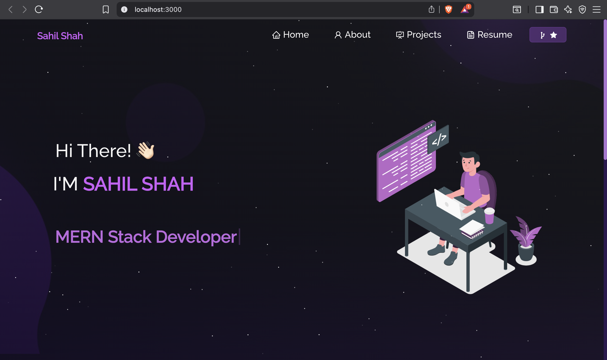

# 🌟 Personal Portfolio Website

A modern, responsive personal portfolio website built with React.js, showcasing my projects, skills, and professional journey as a B.Tech Information Technology student.



## 🚀 Live Demo

Visit my portfolio: [https://portfolio-nu-eight-l31vd2hvrx.vercel.app/](https://portfolio-nu-eight-l31vd2hvrx.vercel.app/)

## 📋 Table of Contents

- [Features](#features)
- [Tech Stack](#tech-stack)
- [Installation](#installation)
- [Usage](#usage)
- [Project Structure](#project-structure)
- [Projects Showcase](#projects-showcase)
- [Contributing](#contributing)
- [Contact](#contact)

## ✨ Features

- **Responsive Design**: Fully responsive across all devices and screen sizes
- **Modern UI/UX**: Clean, professional design with smooth animations
- **Interactive Elements**: 
  - Particle.js background effects
  - Parallax tilt effects on images
  - Typewriter effect for dynamic text
  - Smooth scrolling navigation
- **Project Showcase**: Detailed project cards with GitHub links and live demos
- **Skills Section**: Visual representation of technical skills and tools
- **Resume Integration**: Downloadable resume with PDF viewer
- **GitHub Integration**: Real-time GitHub contribution calendar
- **Social Links**: Direct links to professional profiles
- **SEO Optimized**: Meta tags and structured data for better search visibility

## 🛠️ Tech Stack

**Frontend:**
- React.js 18.3.1
- React Router DOM 6.2.2
- React Bootstrap 2.2.1
- Bootstrap 5.1.3

**Styling & UI:**
- CSS3 with custom styles
- React Icons 4.8.0
- React Parallax Tilt 1.7.42

**Effects & Animations:**
- React TSParticles 1.42.2
- Typewriter Effect 2.18.2

**Additional Libraries:**
- React PDF 5.7.1
- React GitHub Calendar 3.2.2
- Axios 0.26.1

**Development Tools:**
- React Scripts 5.0.0
- Web Vitals 2.1.4

## 🔧 Installation

1. **Clone the repository**
   ```bash
   git clone https://github.com/SahilS1903/Portfolio.git
   cd Portfolio
   ```

2. **Install dependencies**
   ```bash
   npm install
   ```

3. **Start the development server**
   ```bash
   npm start
   ```

4. **Open your browser**
   Navigate to `http://localhost:3000` to view the portfolio

## 🎯 Usage

### Development
```bash
npm start          # Start development server
npm test           # Run tests
npm run build      # Build for production
npm run eject      # Eject from Create React App
```

### Customization

1. **Personal Information**: Update personal details in `src/components/Home/Home.js` and `src/components/Home/Home2.js`

2. **Projects**: Modify project data in `src/components/Projects/Projects.js`
   - Add project images to `src/Assets/Projects/`
   - Update GitHub links and demo URLs

3. **Skills**: Edit technical skills in `src/components/About/Techstack.js` and tools in `src/components/About/Toolstack.js`

4. **Resume**: Replace `src/Assets/Sahil_Resume.pdf` with your own resume

5. **Social Links**: Update social media links in `src/components/Home/Home2.js` and `src/components/Footer.js`

## 📁 Project Structure

```
Portfolio/
├── public/
│   ├── index.html
│   ├── favicon.png
│   ├── manifest.json
│   └── robots.txt
├── src/
│   ├── components/
│   │   ├── About/
│   │   │   ├── About.js
│   │   │   ├── AboutCard.js
│   │   │   ├── Github.js
│   │   │   ├── Techstack.js
│   │   │   └── Toolstack.js
│   │   ├── Home/
│   │   │   ├── Home.js
│   │   │   ├── Home2.js
│   │   │   └── Type.js
│   │   ├── Projects/
│   │   │   ├── Projects.js
│   │   │   └── ProjectCards.js
│   │   ├── Resume/
│   │   │   └── ResumeNew.js
│   │   ├── Footer.js
│   │   ├── Navbar.js
│   │   ├── Particle.js
│   │   ├── Pre.js
│   │   └── ScrollToTop.js
│   ├── Assets/
│   │   ├── Projects/
│   │   │   ├── FitFusion.png
│   │   │   ├── ResumeBuilder.png
│   │   │   └── Streamify.png
│   │   ├── about.png
│   │   ├── avatar.svg
│   │   ├── home-bg.jpg
│   │   ├── home-main.svg
│   │   ├── logo.png
│   │   ├── pre.svg
│   │   └── Sahil_Resume.pdf
│   ├── App.js
│   ├── App.css
│   ├── index.js
│   ├── index.css
│   └── style.css
├── Images/
│   ├── readme-img.png
│   └── readme-img1.png
├── package.json
└── README.md
```

## 🎨 Projects Showcase

The portfolio features three main projects:

### 1. 🏋️ Fitness Tracker (MERN Stack)
- **Description**: Comprehensive fitness tracking application
- **Technologies**: MongoDB, Express.js, React.js, Node.js
- **Features**: Workout logging, progress tracking, analytics
- **Live Demo**: [FitFusion](https://fitfusion-ashy.vercel.app)

### 2. 📄 Resume Builder (React)
- **Description**: Dynamic resume builder with customizable templates
- **Technologies**: React.js
- **Features**: Real-time preview, PDF export, multiple themes
- **Live Demo**: [Resume Builder](https://react-resume-builder-brown.vercel.app)

### 3. 💬 Streamify - Chat & Video App (MERN Stack)
- **Description**: Full-featured communication platform
- **Technologies**: MERN Stack, WebRTC, Socket.io
- **Features**: Real-time messaging, video calls, file sharing
- **Live Demo**: [Streamify](https://streamify-kwwc.onrender.com)

## 🔧 Environment Variables

Create a `.env` file in the root directory for any environment-specific configurations:

```env
REACT_APP_GITHUB_USERNAME=SahilS1903
REACT_APP_GITHUB_TOKEN=your_github_token_here
```

## 🚀 Deployment

### GitHub Pages
```bash
npm install --save-dev gh-pages
npm run build
npm run deploy
```

### Vercel
1. Connect your GitHub repository to Vercel
2. Configure build settings:
   - Build Command: `npm run build`
   - Output Directory: `build`
3. Deploy

### Netlify
1. Build the project: `npm run build`
2. Drag and drop the `build` folder to Netlify
3. Configure domain settings

## 🤝 Contributing

Contributions, issues, and feature requests are welcome!

1. Fork the repository
2. Create your feature branch (`git checkout -b feature/AmazingFeature`)
3. Commit your changes (`git commit -m 'Add some AmazingFeature'`)
4. Push to the branch (`git push origin feature/AmazingFeature`)
5. Open a Pull Request

## 📱 Browser Support

- Chrome (latest)
- Firefox (latest)
- Safari (latest)
- Edge (latest)

## 📄 License

This project is open source and available under the [MIT License](LICENSE).

## 📞 Contact

**Sahil Shah**
- GitHub: [@SahilS1903](https://github.com/SahilS1903)
- LinkedIn: [Sahil Shah](https://www.linkedin.com/in/sahil-shah-8780a8312/)
- Instagram: [@s_._s_.3831](https://www.instagram.com/s_._s_.3831)
- Email: sahilshah@example.com

---

⭐ **If you found this project helpful, please give it a star!** ⭐

---

*Built with ❤️ by Sahil Shah*
